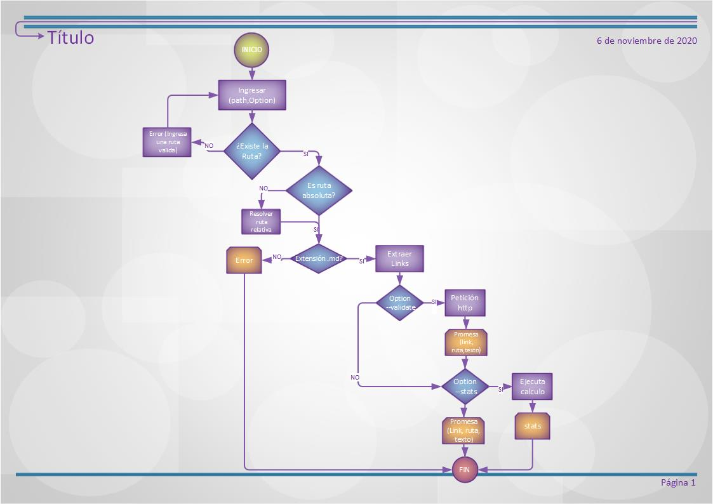

# Markdown Links Check

## Índice

* [1. Preámbulo](#1-preámbulo)
* [2. Diagrama de Flujo](#2-Diagrama-de-flujo)
* [3. Requerimientos Previos](#3-Requerimientos-previos)
* [4. Tópicos](#4-Tópicos)
* [5. Librerías Utilizadas](#5-Librerías-Utilizadas)
* [6. Lenguaje](#6-Lenguaje)
* [7. Instalación](#7-Instalación)
* [8. Modo de Uso](#8-Modo-de-Uso)
* [9. Versión](#9-Versión)
* [10. Autor](#10-Autor)

***

## 1. Preámbulo

[Markdown](https://es.wikipedia.org/wiki/Markdown) es un lenguaje de marcado
ligero muy popular entre developers. Es usado en muchísimas plataformas que
manejan texto plano (GitHub, foros, blogs, ...), y es muy común
encontrar varios archivos en ese formato en cualquier tipo de repositorio
(empezando por el tradicional `README.md`).

Estos archivos `Markdown` normalmente contienen _links_ (vínculos/ligas) que
muchas veces están rotos o ya no son válidos y eso perjudica mucho el valor de
la información que se quiere compartir.

Dentro de una comunidad de código abierto, nos han propuesto crear una
herramienta usando [Node.js](https://nodejs.org/), que lea y analice archivos
en formato `Markdown`, para verificar los links que contengan y reportar
algunas estadísticas.


## 2. Diagrama de Flujo



## 3. Requerimientos Previos

* Node.js

## 4. Tópicos
+ [Node.js](https://nodejs.org/en/)
+ [File System](https://nodejs.org/api/fs.html)
+ [path](https://nodejs.org/api/path.html)

## 5. Librerías Utilizadas

+ fs
+ path
+ chalk
+ node-fetch

## 6. Lenguaje

El código esta escrito en lenguaje javascrypt.

## 7. Instalación 

Para agregar el modulo, instala:

```
npm install -g lizguroart/bog001-md-links
```

## 8. Modo de Uso

`md-Links(path, options)`


Argumentos

* path: Ruta absoluta o relativa al archivo o directorio. Si la ruta pasada es relativa, debe resolverse con respecto al directorio desde donde se invoca node (current working directory).
* options: Un objeto con las siguientes propiedades:
    * validate: Booleano que determina si se desea validar los links encontrados.

Para poder extraer los archivos de un archivo específico ejecuta el siguiente comando Comando "md-Links" + la ruta de tu archivo md-links ejemplo.md

Opciones: Si deseas validar los link y/o ver sus estadisticas ejecuta el siguiente comando

`--validate` (Verifica si el link funciona o no. Si el link resulta en una redirección a una URL el link se considerará como ✔ OK en caso contrario ✖ error, not found)

`--stats` (Será un texto con estadísticas básicas sobre los links).

`--validate--stast`(Para obtener estadísticas que necesiten de los resultados de la validación).

Ejemplo:

`md-Links ejemplo.md --validate`
```
href: https://es.wikipedia.org/wiki/Markdown
Text: Markdown
path: D:\LEARNING\1. PROGRAMACIÓN\LABORATORIA\PROYECTOS\BOG001-data-lovers\Archivo
statusCode: 200
status: OK
```

`md-Links ejemplo.md --stats`
```
Total Links: 4
Unique Links: 4
```

`md-Links ejemplo.md --validate --stats`
```
Total Links: 4
Unique: 4
Broken: 1
```

## 9. Versión 

**Versión 0.1.0**

## 10. Autor 

**Diana Gutierrez**
